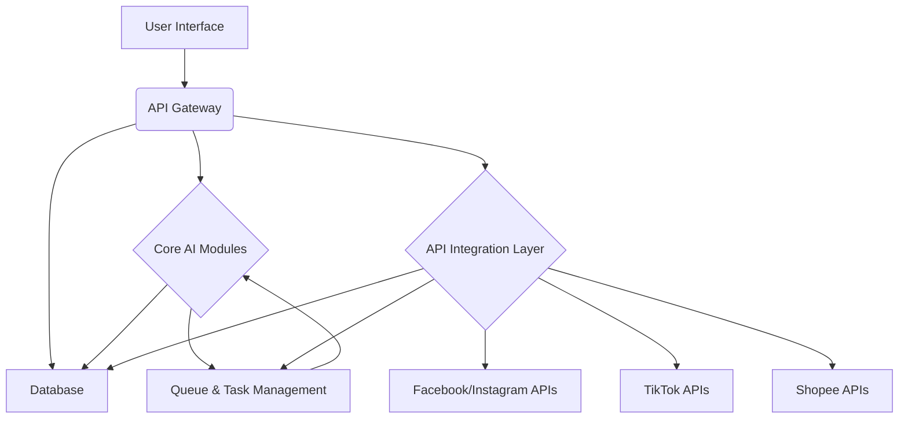

# สถาปัตยกรรมแพลตฟอร์ม AI สำหรับการยิงโฆษณาแบบครบวงจร

## เป้าหมายของแพลตฟอร์ม

แพลตฟอร์มนี้มีเป้าหมายเพื่อเป็นโซลูชัน AI สำหรับการจัดการโฆษณาแบบครบวงจรบนแพลตฟอร์มหลัก ได้แก่ Facebook, Instagram, TikTok และ Shopee โดยมุ่งเน้นการช่วยให้ผู้ขายสามารถเข้าถึงกลุ่มเป้าหมายได้อย่างแม่นยำ เพิ่มประสิทธิภาพแคมเปญโฆษณา และลดภาระงานด้วยตนเอง นอกจากนี้ แพลตฟอร์มจะถูกออกแบบมาให้มีศักยภาพในการนำไปจำหน่ายต่อได้ในอนาคต

## ส่วนประกอบหลักของแพลตฟอร์ม

แพลตฟอร์ม AI สำหรับการยิงโฆษณาจะประกอบด้วยส่วนประกอบหลักดังต่อไปนี้:

### 1. โมดูล AI หลัก (Core AI Modules)

*   **การกำหนดกลุ่มเป้าหมายอัจฉริยะ (Intelligent Audience Targeting):**
    *   **หน้าที่:** วิเคราะห์ข้อมูลลูกค้า, พฤติกรรมผู้ใช้, ความสนใจ, และข้อมูลเชิงประชากรจากแพลตฟอร์มต่างๆ เพื่อสร้างกลุ่มเป้าหมายที่มีแนวโน้มตอบสนองสูงสุด
    *   **เทคโนโลยี:** Machine Learning (ML) สำหรับการจัดกลุ่ม (Clustering), การจำแนกประเภท (Classification), และการสร้าง Lookalike Audience

*   **การสร้างสรรค์โฆษณาด้วย AI (AI-powered Creative Generation):**
    *   **หน้าที่:** สร้างข้อความโฆษณา, หัวข้อ, คำบรรยาย, และแนะนำรูปภาพ/วิดีโอที่เหมาะสมกับแต่ละแพลตฟอร์มและกลุ่มเป้าหมาย
    *   **เทคโนโลยี:** Generative AI (เช่น Large Language Models สำหรับข้อความ, Diffusion Models สำหรับรูปภาพ/วิดีโอ) โดยอิงจากข้อมูลประสิทธิภาพในอดีตและแนวโน้ม

*   **การเพิ่มประสิทธิภาพแคมเปญ (Campaign Optimization):**
    *   **หน้าที่:** ปรับการเสนอราคา (Bidding), งบประมาณ, และการจัดส่งโฆษณาแบบเรียลไทม์เพื่อเพิ่ม ROI และบรรลุเป้าหมายที่กำหนดไว้ (เช่น Conversion, Click-through Rate)
    *   **เทคโนโลยี:** Reinforcement Learning, Predictive Analytics เพื่อคาดการณ์ประสิทธิภาพและปรับกลยุทธ์

*   **การวิเคราะห์และรายงานเชิงลึก (Advanced Analytics & Reporting):**
    *   **หน้าที่:** รวบรวม, ประมวลผล, และแสดงผลข้อมูลประสิทธิภาพโฆษณาจากทุกแพลตฟอร์มในรูปแบบที่เข้าใจง่าย พร้อมให้คำแนะนำเชิงรุกในการปรับปรุง
    *   **เทคโนโลยี:** Data Visualization, Business Intelligence (BI) Tools, Anomaly Detection

### 2. ส่วนเชื่อมต่อ API (API Integration Layer)

ส่วนนี้จะทำหน้าที่เป็นตัวกลางในการเชื่อมต่อและสื่อสารกับ API ของแต่ละแพลตฟอร์มโฆษณา

*   **Meta Marketing API / Graph API (สำหรับ Facebook & Instagram):**
    *   **หน้าที่:** จัดการแคมเปญ, ชุดโฆษณา, โฆษณา, กลุ่มเป้าหมาย (Custom Audiences), และดึงข้อมูลเชิงลึก (Insights) ของ Facebook และ Instagram
    *   **ความท้าทาย:** การจัดการ Token, สิทธิ์การเข้าถึง, และการเปลี่ยนแปลง API Version

*   **TikTok API for Business:**
    *   **หน้าที่:** สร้างและจัดการแคมเปญโฆษณา, กลุ่มเป้าหมาย, และดึงข้อมูลรายงานประสิทธิภาพบน TikTok
    *   **ความท้าทาย:** รูปแบบโฆษณาที่เน้นวิดีโอสั้น, การจัดการ Creative Assets

*   **Shopee Open Platform API (ส่วน Ads):**
    *   **หน้าที่:** จัดการโฆษณาผลิตภัณฑ์, การเพิ่มประสิทธิภาพคำหลัก, และดึงข้อมูลการขายที่เกี่ยวข้องกับโฆษณาบน Shopee
    *   **ความท้าทาย:** การเชื่อมโยงข้อมูลโฆษณากับข้อมูลสินค้าและยอดขายโดยตรง

### 3. ส่วนหน้า (Frontend / User Interface)

*   **หน้าที่:** เป็นส่วนที่ผู้ใช้ (ผู้ขาย) จะเข้ามาใช้งานแพลตฟอร์มเพื่อตั้งค่า, ตรวจสอบ, และจัดการแคมเปญโฆษณา
*   **คุณสมบัติ:**
    *   Dashboard แสดงภาพรวมประสิทธิภาพโฆษณาแบบรวมศูนย์
    *   เครื่องมือสร้างแคมเปญที่ขับเคลื่อนด้วย AI (AI-assisted campaign builder)
    *   การจัดการ Creative Assets และ Library
    *   การตั้งค่ากลุ่มเป้าหมายและการปรับแต่ง
    *   รายงานและคำแนะนำเชิงลึกที่เข้าใจง่าย
    *   ระบบจัดการผู้ใช้และสิทธิ์ (สำหรับกรณีนำไปจำหน่ายต่อ)

### 4. ฐานข้อมูล (Database)

*   **หน้าที่:** จัดเก็บข้อมูลแคมเปญ, ข้อมูลประสิทธิภาพ, ข้อมูลผู้ใช้, Creative Assets, และข้อมูลอื่นๆ ที่จำเป็นสำหรับการทำงานของแพลตฟอร์ม
*   **ประเภทข้อมูล:** ข้อมูลเชิงโครงสร้าง (Structured Data) สำหรับการตั้งค่าแคมเปญ, ข้อมูลเชิงเวลา (Time-series Data) สำหรับ Insights, ข้อมูลไม่เชิงโครงสร้าง (Unstructured Data) สำหรับ Creative Assets

### 5. ระบบจัดการคิวและงาน (Queue & Task Management System)

*   **หน้าที่:** จัดการงานที่ต้องทำแบบ Asynchronous เช่น การสร้างโฆษณาจำนวนมาก, การดึงข้อมูลรายงานขนาดใหญ่, การปรับปรุงแคมเปญแบบเรียลไทม์ เพื่อให้แพลตฟอร์มทำงานได้อย่างราบรื่นและมีประสิทธิภาพ

## สถาปัตยกรรมโดยรวม (High-Level Architecture)

แพลตฟอร์มจะถูกออกแบบในลักษณะ Microservices Architecture เพื่อให้มีความยืดหยุ่น, ปรับขนาดได้ง่าย, และสามารถพัฒนาแต่ละส่วนได้อย่างอิสระ

## แผนการพัฒนาในระยะถัดไป

1.  **การวิเคราะห์ API เชิงลึก:** ศึกษาข้อจำกัด, โควต้า, และข้อกำหนดของ API แต่ละแพลตฟอร์มอย่างละเอียด
2.  **การเลือกเทคโนโลยี:** กำหนด Stack เทคโนโลยีสำหรับ Backend, Frontend, Database, และ AI/ML Frameworks
3.  **การพัฒนาโมดูล AI:** เริ่มต้นพัฒนาโมดูลการกำหนดกลุ่มเป้าหมายและการสร้างสรรค์โฆษณา
4.  **การเชื่อมต่อ API:** พัฒนาส่วนเชื่อมต่อกับ API ของแต่ละแพลตฟอร์มตามลำดับความสำคัญ
5.  **การพัฒนา UI/UX:** ออกแบบและพัฒนาส่วนหน้าของแพลตฟอร์มให้ใช้งานง่ายและมีประสิทธิภาพ

เอกสารนี้จะเป็นแนวทางในการพัฒนาแพลตฟอร์ม AI สำหรับการยิงโฆษณาในขั้นตอนต่อไป
